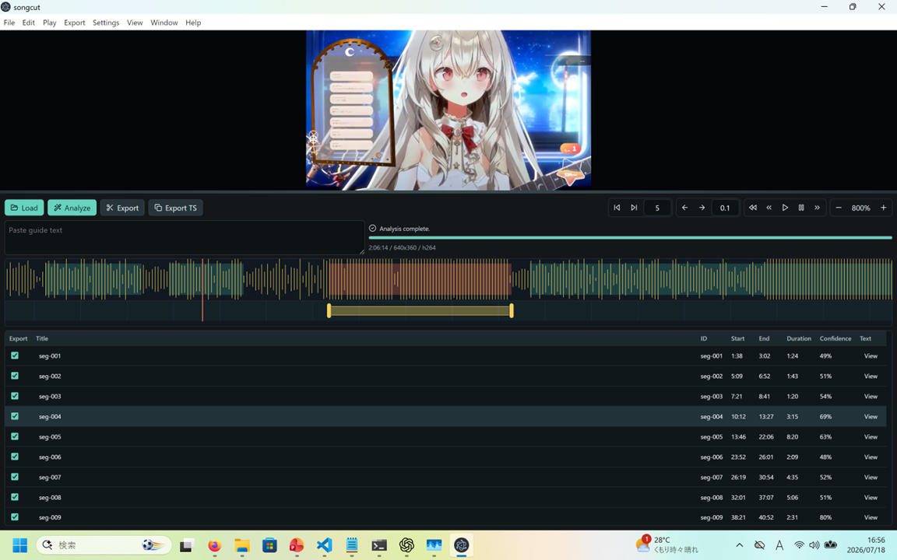

# songcut

English follows the Japanese.

## 日本語

`songcut` は、VSinger などの歌枠アーカイブから歌唱区間らしい部分を抽出し、
セグメント動画として書き出したり、TSコメント作成を支援する Windows デスクトップアプリです。

### 特徴
- 歌枠の切り抜き作成およびタイムスタンプ作成に特化した機能
  - 切り出しセグメントのプレビューツール、微調整ツール
- Opus音声の高速スクラッチプレビュー
- セグメント動画出力時のスマートレンダリング
  - GOP単位で再利用できる動画部分はそのままコピーし、それ以外の部分だけ再エンコード

### 使用方法

1. Releases からダウンロードして適当なフォルダに展開してください。
1. ffmpeg/ffprobe をダウンロードし、`third_party\ffmpeg` 以下に配置してください。
1. `songcut.exe` を起動してください。
1. 使い方は [docs/USAGE.ja.md](docs/USAGE.ja.md) を参照してください。

### 外部仕様

- 配布形態は Windows 向けのポータブル GUI アプリです。
- 利用者向けの入口は、配布物ルートにある `songcut.exe` です。
- 入力動画はローカルファイルとして扱い、検出結果、レビュー用データ、切り出しクリップを
  ローカルに出力します。
- `ffmpeg.exe` と `ffprobe.exe` が必要です。配布物またはリポジトリ配下に配置するか、
  `PATH` から見つかる状態にしてください。
- バッチ処理や外部アプリ連携向けに Python CLI も提供します。

### 文書

- 使い方: [docs/USAGE.ja.md](docs/USAGE.ja.md) / [docs/USAGE.md](docs/USAGE.md)
- CLI: [docs/CLI.ja.md](docs/CLI.ja.md) / [docs/CLI.md](docs/CLI.md)
- ビルド: [docs/BUILD.ja.md](docs/BUILD.ja.md) / [docs/BUILD.md](docs/BUILD.md)
- 設計: [docs/DESIGN.ja.md](docs/DESIGN.ja.md) / [docs/DESIGN.md](docs/DESIGN.md)
- GUI 詳細仕様: [docs/gui-spec.md](docs/gui-spec.md)
- 検出アルゴリズム: [docs/algorithm.md](docs/algorithm.md)

---

## English

`songcut` is a Windows desktop app that extracts likely singing segments from
VSinger-style singing-stream archives, exports them as individual video clips,
and helps prepare timestamp comments.

### Features

- Purpose-built tools for creating clips and timestamp comments from singing
  streams
  - Preview and fine-tuning controls for extracted segments
- Fast scratch previews for Opus audio
- Smart rendering for exported video segments
  - Copies reusable GOPs without re-encoding and re-encodes only the remaining
    portions

### Usage

1. Download a release and extract it to a folder.
1. Download ffmpeg/ffprobe and place them under `third_party\ffmpeg`.
1. Start `songcut.exe`.
1. See [docs/USAGE.md](docs/USAGE.md) for detailed instructions.

### External Specification

- The primary distribution target is a portable Windows GUI app.
- The user-facing entry point is `songcut.exe` at the distribution root.
- Input videos are treated as local files. Detection results, review data, and
  exported clips are written locally.
- `ffmpeg.exe` and `ffprobe.exe` are required. Place them under the distribution
  or repository tree, or make them discoverable on `PATH`.
- A Python CLI is also available for batch processing and external app
  integration.

### Documentation

- Usage: [docs/USAGE.md](docs/USAGE.md) / [docs/USAGE.ja.md](docs/USAGE.ja.md)
- CLI: [docs/CLI.md](docs/CLI.md) / [docs/CLI.ja.md](docs/CLI.ja.md)
- Build: [docs/BUILD.md](docs/BUILD.md) / [docs/BUILD.ja.md](docs/BUILD.ja.md)
- Design: [docs/DESIGN.md](docs/DESIGN.md) / [docs/DESIGN.ja.md](docs/DESIGN.ja.md)
- Detailed GUI specification: [docs/gui-spec.md](docs/gui-spec.md)
- Detection algorithm: [docs/algorithm.md](docs/algorithm.md)
