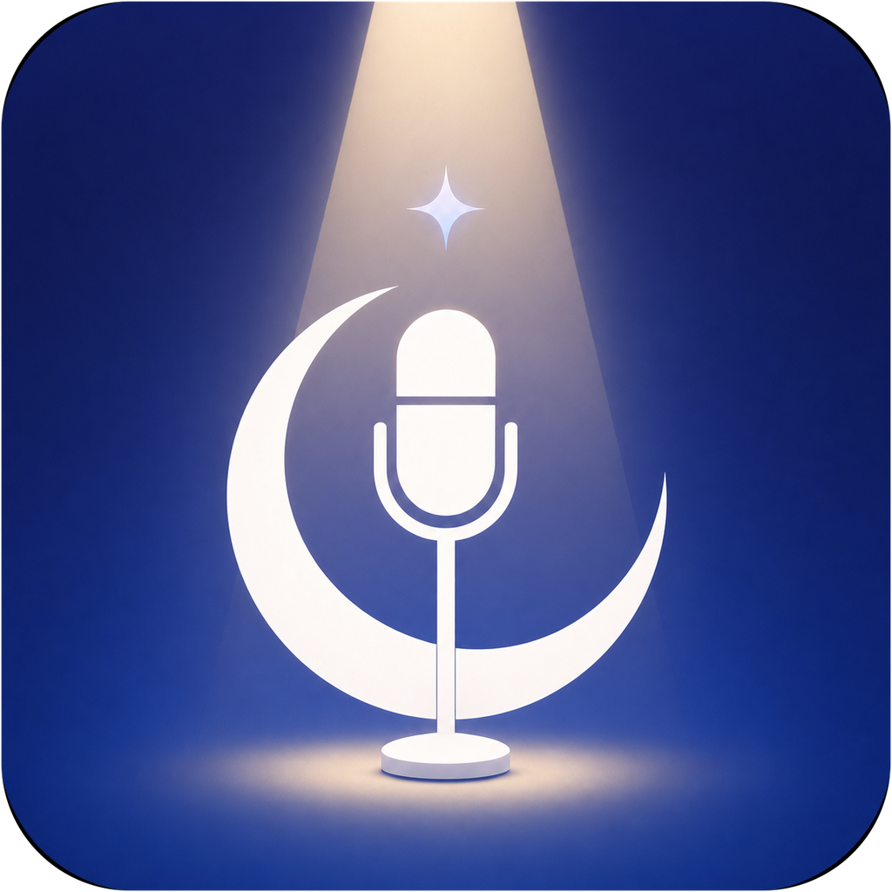

# songcut

English follows the Japanese.

## 日本語

`songcut` は、歌枠アーカイブから切り抜き動画、タイムスタンプコメント、歌詞字幕付き動画を作るための Windows デスクトップアプリです。
画面上部のタブで、歌唱区間を扱う Cut と歌詞字幕を扱う Sub を切り替えられます。

### 目的から選ぶ

- 曲ごとの切り抜き動画やタイムスタンプを作る: [Cutの使い方](docs/USAGE.ja.md#cut)
- 字幕付き動画を作る: [Subの使い方](docs/USAGE.ja.md#sub)
- 選択したTimelineを一つの字幕ファイルへまとめる: [字幕ファイルを書き出し（Export Sub）](docs/USAGE.ja.md#export-subで字幕ファイルを統合する)
- キー操作を確認する: [キーボードショートカット](docs/KEYBOARD_SHORTCUTS.md)

### 代表画面

Cut では歌唱区間をセグメントとして検出し、波形と動画を見ながらタイトルや境界を整えます。
書き出すセグメントを選ぶと、曲ごとの動画クリップやタイムスタンプを作成できます。

Sub では貼り付けた歌詞を音声へ合わせ、字幕タイムライン上で文字とタイミングを調整します。
字幕の位置やスタイルを設定すると、字幕付き動画と字幕ファイルを書き出せます。

### 特徴

- **Cut モード**：歌唱区間を検出し、切り抜き動画やタイムスタンプコメントとして書き出します。
- **Sub モード**：貼り付けた歌詞を音声に合わせ、字幕付き動画または選択したTimelineを統合した字幕ファイルを書き出します。
- 波形、プレビュー再生、キーボード操作を使って区間や字幕の境界を調整できます。
- Cut モードでは、音量変化に合わせて歌唱区間の開始と終了を整えます。
- Sub モードでは、拍グリッド、複数の字幕タイムライン、字幕スタイル、出力エフェクトを利用できます。
- Opus音声の高速スクラッチプレビュー
- セグメント動画出力時のスマートレンダリング

Cut と Sub は同じ動画を読み込めますが、編集内容はモードごとに別のプロジェクトへ保存されます。
切り抜きと字幕を並行して進めても、一方の編集内容がもう一方へ混ざることはありません。

### 使用方法

1. Releases から標準版または Full 版をダウンロードし、任意のフォルダに展開します。
2. `songcut.exe` を起動します。
3. FFmpeg が見つからない場合は、画面の案内に従って準備します。
4. 詳しい操作は [日本語の使い方](docs/USAGE.ja.md) を参照します。

標準版では `third_party` と `models` が空で、FFmpeg と必要な AI モデルを利用者が準備します。
Full 版には、リリースに用意された FFmpeg と AI モデルが含まれます。

### 動作と保存先

- Windows 向けのポータブルアプリです。
- 動画とプロジェクトはローカルで扱います。
- `ffmpeg.exe` と `ffprobe.exe` が必要です。
- 必要な AI モデルは、設定画面から明示的に準備できます。
- 開発、自動化、診断向けに Python CLI も提供します。

### 文書

- 使い方: [docs/USAGE.ja.md](docs/USAGE.ja.md) / [docs/USAGE.md](docs/USAGE.md)
- キーボードショートカット: [docs/KEYBOARD_SHORTCUTS.md](docs/KEYBOARD_SHORTCUTS.md)
- 文書一覧: [docs/INDEX.md](docs/INDEX.md)
- CLI: [docs/CLI.ja.md](docs/CLI.ja.md) / [docs/CLI.md](docs/CLI.md)
- ビルド: [docs/BUILD.ja.md](docs/BUILD.ja.md) / [docs/BUILD.md](docs/BUILD.md)
- 設計: [docs/DESIGN.ja.md](docs/DESIGN.ja.md) / [docs/DESIGN.md](docs/DESIGN.md)

---

## English

`songcut` is a Windows desktop app for creating clips, timestamp comments, and
lyric-subtitled videos from singing-stream archives.
Use the tabs at the top of the window to switch between Cut for singing
segments and Sub for timed lyrics.

### Choose a path

- Make song clips or timestamp comments: [Cut usage](docs/USAGE.md#cut)
- Make a subtitled video: [Sub usage](docs/USAGE.md#sub)
- Combine selected timelines into one subtitle file: [Export Sub](docs/USAGE.md#export-subtitles-into-one-file)
- Check keyboard controls: [Keyboard shortcuts](docs/KEYBOARD_SHORTCUTS.md)

### Representative Screens

Cut detects singing sections as segments and lets you refine their titles and
boundaries while watching the video and waveform.
Select the segments to export them as individual clips or timestamp text.

Sub aligns pasted lyrics to the audio and lets you adjust text and timing on
subtitle timelines.
After choosing positions and styles, export a subtitled video and subtitle
files.

### Features

- **Cut mode** detects likely singing segments and exports clips or timestamp
  comments.
- **Sub mode** aligns pasted lyrics to the audio and lets you export either a
  subtitled video or one subtitle file made from selected timelines.
- Waveform, preview, and keyboard controls help adjust clip and subtitle
  boundaries.
- Cut mode can refine singing-segment boundaries around local level changes.
- Sub mode provides a rhythm grid, multiple subtitle timelines, reusable styles,
  and export effects.
- Fast scratch previews for Opus audio
- Smart rendering for exported video segments

Cut and Sub can use the same source video, but each mode saves its edits in a
separate project file.
This keeps clip editing and subtitle editing independent when you work on both.

### Usage

1. Download either the standard or Full release and extract it to a folder.
2. Start `songcut.exe`.
3. If FFmpeg is not found, follow the on-screen instructions to prepare it.
4. See the [English usage guide](docs/USAGE.md) for detailed instructions.

The standard archive leaves `third_party` and `models` empty, so you prepare
FFmpeg and the AI models you need.
The Full archive includes the FFmpeg and AI model files prepared for that
release.

### Operation and storage

- songcut is a portable Windows app.
- Source videos, projects, and exports stay on the local computer.
- `ffmpeg.exe` and `ffprobe.exe` are required.
- Required AI models can be prepared explicitly from Settings.
- A Python CLI is available for development, automation, and diagnostics.

### Documentation

- Usage: [docs/USAGE.md](docs/USAGE.md) / [docs/USAGE.ja.md](docs/USAGE.ja.md)
- Keyboard shortcuts: [docs/KEYBOARD_SHORTCUTS.md](docs/KEYBOARD_SHORTCUTS.md)
- Document index: [docs/INDEX.md](docs/INDEX.md)
- CLI: [docs/CLI.md](docs/CLI.md) / [docs/CLI.ja.md](docs/CLI.ja.md)
- Build: [docs/BUILD.md](docs/BUILD.md) / [docs/BUILD.ja.md](docs/BUILD.ja.md)
- Design: [docs/DESIGN.md](docs/DESIGN.md) / [docs/DESIGN.ja.md](docs/DESIGN.ja.md)
