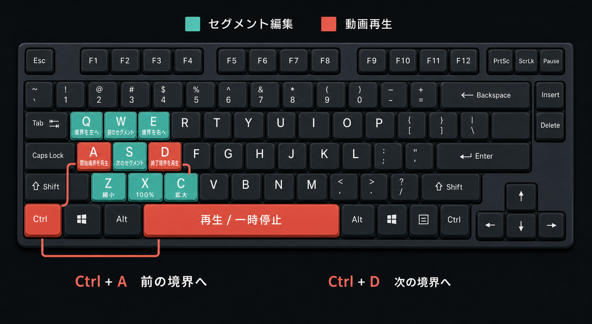
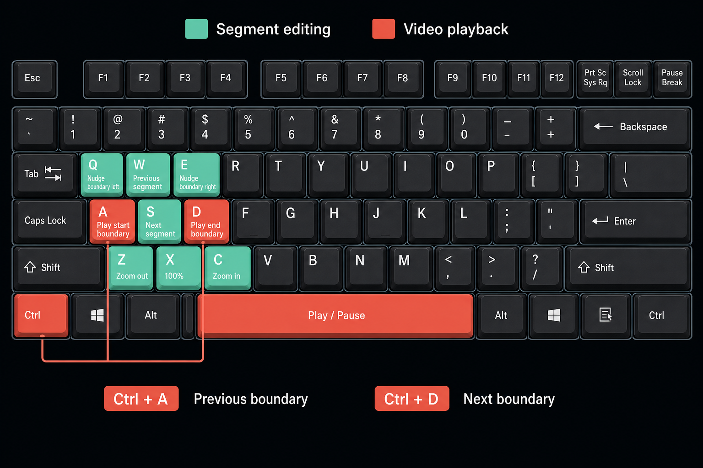

# Keyboard Shortcuts

English follows the Japanese.

[日本語](#日本語) | [English](#english)

## 日本語

`songcut` の編集画面では、動画再生、セグメント選択、境界調整、ズームをキーボードで操作できます。

### 共通

| キー | 操作 |
| --- | --- |
| `A` / `D` | 選択区間の開始／終了境界を再生 |
| `Space` | 再生／一時停止を切り替え |
| `Ctrl+A` / `Ctrl+D` | 前／次の境界へ移動 |
| `Z` / `X` / `C` | タイムラインを縮小／100%に戻す／拡大 |

### Cut

| キー | 操作 |
| --- | --- |
| `W` / `S` | 前／次の Cut セグメントを選択 |
| `Q` / `E` | 最寄りの境界を設定秒数だけ左／右へ微調整 |

### Sub

| キー | 操作 |
| --- | --- |
| `W` / `S` | アクティブレーン内の前／次の区間を選択 |
| `Q` / `E` | 選択境界を前／次の1/4拍へ移動 |

キーを押し続けてもショートカットはリピートしません。

入力欄、ダイアログ、IMEで文字を変換している間はショートカットが無効になります。

選択移動は各モードの先頭と末尾で停止し、循環しません。

---

## English

The `songcut` editor uses the keyboard for playback, segment selection, boundary editing, and zoom.

### Common

| Key | Action |
| --- | --- |
| `A` / `D` | Play the start / end boundary of the selected section |
| `Space` | Toggle play / pause |
| `Ctrl+A` / `Ctrl+D` | Jump to the previous / next boundary |
| `Z` / `X` / `C` | Zoom the timeline out / reset to 100% / zoom in |

### Cut

| Key | Action |
| --- | --- |
| `W` / `S` | Select the previous / next Cut segment |
| `Q` / `E` | Nudge the nearest boundary left / right by the configured seconds |

### Sub

| Key | Action |
| --- | --- |
| `W` / `S` | Select the previous / next section inside the active lane |
| `Q` / `E` | Move the selected boundary to the previous / next quarter beat |

Holding a key does not repeat a shortcut.

Shortcuts are disabled while an input, dialog, or IME composition is active.

Selection stops at the first and last item in each mode instead of wrapping around.
