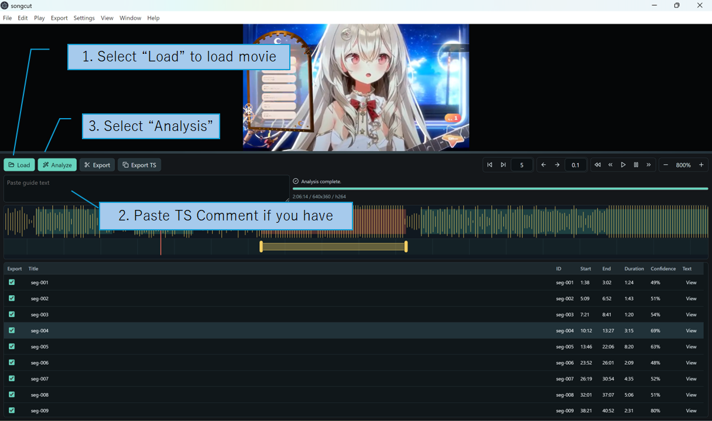
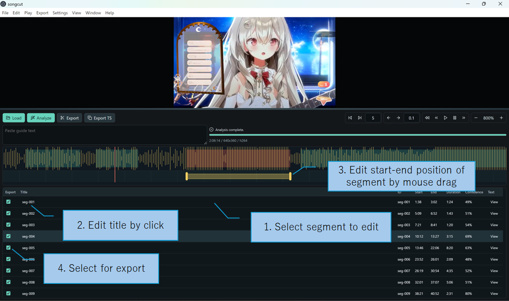
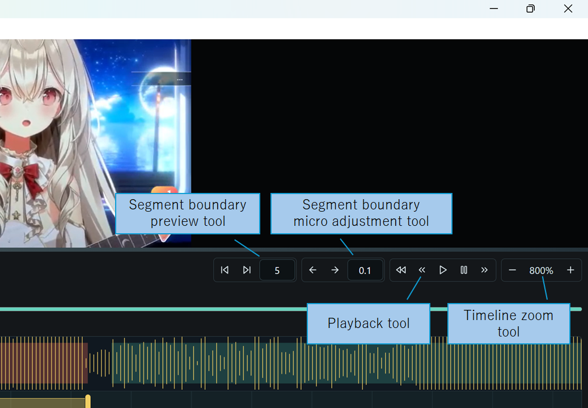
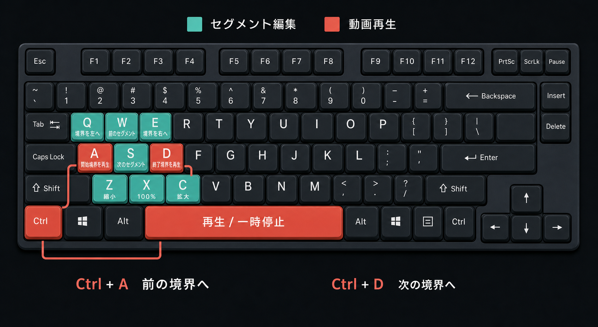

# 動画ファイルの準備
yt-dlpなどを使って動画ファイルをダウンロードしておいてください。
下記のコマンドで簡単に準備できます。

```
winget install yt-dlp.yt-dlp
winget install DenoLand.Deno
```

インストール後、コマンドラインを再起動して下記でダウンロードします。--write-comments でコメントデータを同時にダウンロードしておくと、タイムスタンプコメントがある場合に自動でインポートできます。
```
yt-dlp --write-comments "<YouTube URL>"
```

# ffmpegの準備
起動時にffmpegが見つからないエラーが出る場合、下記のコマンドでインストールしてアプリを再起動してください。
```
winget install Gyan.FFmpeg
```

# 動画の読み込みと解析


Load ボタンを押し動画を指定してください。
タイムスタンプコメントがすでにある場合は”Paste timestamp comment here”の欄にペーストしてください。

動画と同名のyt-dlp `.info.json` がある場合、songcutは動画概要欄と取得済みコメントからタイムスタンプガイドを探します。このメタデータもダウンロードする場合は、次のように実行してください。

```powershell
yt-dlp --write-comments "<YouTube URL>"
```

候補が1件の場合は編集画面が直接開き、2件の場合は動画概要欄またはコメントを選択してから編集します。適用前に、配信開始、MC、宣伝、雑談、告知など、曲ではないタイムスタンプを削除してください。**Apply to guide** を押した場合だけガイド欄を置き換えます。Close、Cancel、Skipでは現在のガイドを変更しません。

AnaLyze ボタンを押すと歌唱部分の解析を開始します。タイムスタンプコメントがある場合、開始点はタイムスタンプコメントから取得し、終了点が自動的に解析されます。

波形生成は動画の読み込み時に歌唱解析とは独立して開始されます。生成済み部分から左から右へ順次表示されるため、解析完了を待たずにタイムラインをシークできます。同じ元動画を開き直した場合はプロジェクトに保存済みの波形を再利用します。生成に失敗した場合はステータス欄のRetryから再実行できます。

# プロジェクト保存と復旧

動画を正常に読み込むと、動画と同じフォルダに `video.mp4.songcut` 形式のプロジェクトが作成されます。編集内容は自動保存され、`Ctrl+S` または **File > Save Project Now** で即時保存できます。保存状態はツールバーとタイトルバーの `Saved`、`Saving…`、`Recovery only`、`Save failed` で確認できます。

異常終了後にsidecarより新しい復旧データが残っている場合、次回起動時にRecover/Discardを選択できます。元動画を移動・改名した場合は **File > Relink Source** を使ってください。同一動画かどうかはファイルサイズと先頭・末尾のSHA-256で確認されます。元動画がなくても、保存済みのガイド、波形、区間、文字起こしは閲覧できます。

`.songcut`はUTF-8のローカルJSONです。波形は固定長バイナリへ詰めたうえでBase64として格納し、sidecarの容量を抑えます。共有すると、元動画のローカル絶対パス、ガイド、編集区間、文字起こしも共有されます。メディア本体、スクラッチプロキシ、Whisperモデル、一時WAV、バックエンドのジョブIDは含まれません。旧プロジェクトスキーマのマイグレーションは行いません。

# Whisper文字起こし

Whisperは新規プロジェクトで既定OFFです。ツールバーの**Settings**または**Settings > Settings...**（`Ctrl+,`）からSettingsダイアログを開き、**Whisper transcription**をONにすると、Tiny / Base / Small、対応言語、Auto / NPU / GPU / CPUをプロジェクト単位で選択できます。既定はSmall、日本語、Autoです。モデルは同じダイアログ内の**Prepare Whisper Model**を明示的に押した場合だけ準備され、Model欄で現在選択しているモデルが対象になります。Language欄は保存済みコードを検索語として扱わず、未検索時はAuto、Japanese、English、Chinese、Koreanの順で先頭に表示します。

歌唱区間の検出と文字起こしは別ジョブです。WhisperをOFFにしても歌唱解析は通常どおり動作し、検出後にSettingsダイアログから**Transcribe / Re-transcribe**だけを実行できます。modelまたはlanguageを変更すると既存結果は残ったまま再文字起こしが必要と表示されます。中断後は、同じ設定なら完了済み区間を保持して残りだけ再開します。Whisper設定はメイン編集画面には常駐しません。

## 表示言語

songcut は既定で Electron／システムのアプリケーション言語に従います。**設定 >
Language / 言語** で **System default / システムの設定**、**English / 英語**、
**Japanese / 日本語** を選択できます。選択は次回の songcut 起動時に適用され、
アプリケーションメニュー、ネイティブダイアログ、ショートカット表記、編集画面の
言語が揃います。この設定はアプリ共通で、`.songcut` プロジェクトには保存されません。
日本語表示時は言語設定ブロックだけ英語を先頭に併記し、英語表示時は英語だけを表示します。

# 動画セグメントの編集

下部にセグメントリストが表示されるので、クリックしてください。
セグメントのタイトルはクリックして編集できます。タイムスタンプコメントが指定された場合は自動的に反映されています。
ウェーブフォームタイムラインをクリックすると再生位置を移動できます。
セグメントタイムラインに表示されている左右のハンドルでセグメントの開始位置と終了位置を編集します。
各セグメントのチェックボックスで、そのセグメントを動画またはTSコメントとして出力するかどうかを指定します。

**Segment**メニューには、選択できない見出しと区切り線でグループ化したセグメント操作が直に並びます。

- **Segment Selection**で前後のセグメントを選択します。
- **Segment Management**見出しの下にある**New Segment**は現在の再生位置にチェック済みの5秒間のセグメントを作成します。選択中のセグメントがあればその直後へ挿入し、明示的な選択がなければ末尾へ追加します。
- **Remove Segment...**と**Remove All Unchecked Segments...**は、対象セグメントを確認画面に表示してから削除します。
- **Sort Segments...**は現在の順序と開始時刻順に並べた結果を左右に表示し、確認後に適用します。
- **Export Selection**見出しの下で全チェック、全チェック解除、チェック反転を行えます。

メニューの区切り見出しは選択不可で、`-- 見出し名 --`の形式で表示します。グループ間には区切り線を置き、各コマンドはサブメニューにせず見出しの直下へ並べます。

**Export**メニューには**Export Movie**に続いて、選択できない**-- Timestamp --**見出しがあり、その下に**タイムスタンプコメント**、**YouTubeチャプター**、**TSV/Excel**、**CSV**、**Audacityラベル**が並びます。**TSV/Excel**と**CSV**には**Start**、**End**、**Title**のヘッダ行が付きます。これらのメニュー項目は**Export TS**の形式選択ダイアログを表示せず、選んだ形式を直接コピーします。

# 便利な編集機能


## セグメントプレビューツール
セグメントプレビューツールを使うと、セグメントの先頭および終端をプレビュー再生します。プレビューする時間は秒数を入力して変更できます。この値は次回起動時にも引き継がれます。

## セグメント微調整ツール
セグメント微調整ツールで、セグメント位置を微調整できます。微調整する長さは秒数を入力して変更できます。初期値は0.5秒で、この値は次回起動時にも引き継がれます。
どの境界が調整されるかは、現在選択中のセグメントの開始・終了のうち、再生位置に近い方から自動的に判定されます。他のセグメントの境界がより近くても、選択中セグメントが優先されます。
先頭を微調整すると新しい先頭からセグメント終端まで再生します。終端を微調整すると新しい終端の「微調整幅×2」前（セグメント先頭より前になる場合は先頭）から再生し、新しい終端で停止します。再生中・停止中のどちらから操作しても、この試聴を開始します。

## タイムラインズーム
タイムラインの拡大縮小ができます。

## スクラッチ用音声プロキシ
Opus音声の動画をLoadすると、シークの速いAACスクラッチ用プロキシをバックグラウンドで作成します。作成が完了するまでは元動画の音声を使い、完了後は次のドラッグ位置からプロキシへ切り替わります。通常再生と書き出しには常に読み込んだ元動画が使われます。

プロキシは既定で有効です。非可逆変換を経由せず元音声でスクラッチ試聴したい場合は、Settingsダイアログの**Use Scratch Audio Proxy**をOFFにしてください。この設定は次回起動時にも引き継がれます。

## 再生コントロール
一般的な動画再生コントロールができます。境界間のジャンプもできます。

## キーボードショートカット


| キー | 操作 |
| --- | --- |
| `A` / `D` | 選択セグメントの開始／終了境界を再生 |
| `W` / `S` | 前／次のセグメントを選択 |
| `Q` / `E` | 最寄りの境界を左／右へ微調整 |
| `Space` | 再生／一時停止を切り替え |
| `Ctrl+A` / `Ctrl+D` | 前／次の境界へ移動 |
| `Z` / `X` / `C` | ズーム縮小／100%へ戻す／拡大 |

キーを押し続けてもショートカットはリピートしません。フォーム部品にフォーカスがある間、IMEで文字を変換している間、ダイアログが開いている間は無効になります。セグメント選択は先頭と末尾で停止し、循環しません。

上下ペインの分割位置も次回起動時に引き継がれます。

# 出力
Export ボタンを押すと、各セグメントの動画を出力します。
Export Reviewでは、`{index}`、`{title}`、`{id}`、`{start}`、`{end}`を使ってファイル名テンプレートを指定できます。既定値は`{index}_{title}`です。実際に使われる安全化済みファイル名は出力前の一覧で確認できます。同じテンプレートは **Settings > Export** でも変更でき、プロジェクトごとに `.songcut` へ保存されます。

**Create a "<source>" folder inside the selected output folder**をONにすると、選択した出力先の中に元動画と同名のフォルダを作り、動画クリップと任意のTSコメントファイルをその中へ出力します。このチェック状態はアプリ共通設定として次回起動時にも引き継がれます。

Export TSボタンを押すと、タイムスタンプコメントとしてセグメントリストをコピーします。
