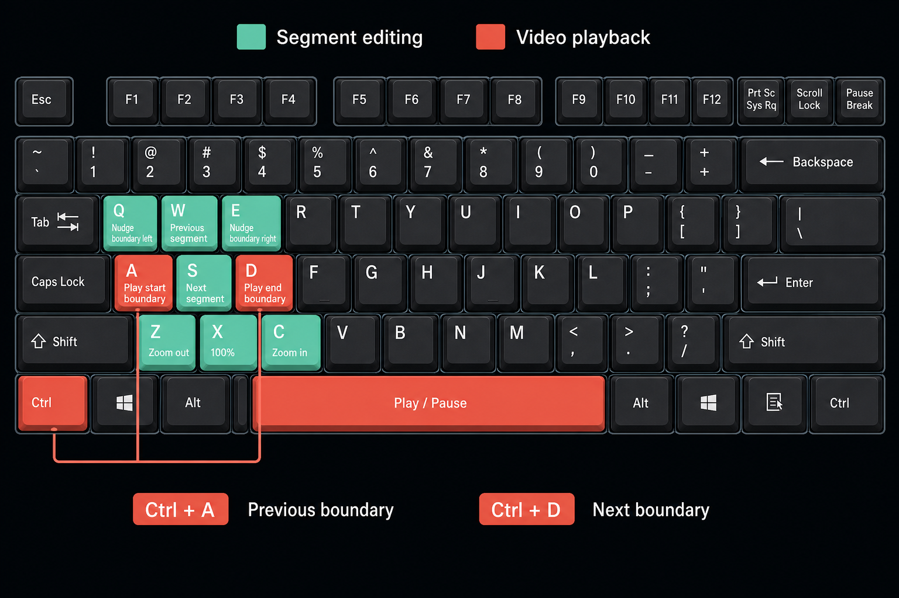

# Preparing a Video File

Download the video file in advance using a tool such as `yt-dlp`. On Windows,
you can install the required tools with the following commands:

```powershell
winget install yt-dlp.yt-dlp
winget install DenoLand.Deno
```

After installation, restart your terminal and download the video:

```powershell
yt-dlp "<YouTube URL>"
```

# Installing FFmpeg

If the app reports that it cannot find FFmpeg at startup, install it with the
following command, then restart the app:

```powershell
winget install Gyan.FFmpeg
```

# Loading and Analyzing a Video


Click **Load** and select a video file. If you already have a timestamp comment,
paste it into the **Paste timestamp comment here** field.

If the video was downloaded with a matching yt-dlp `.info.json`, songcut checks
the video description and downloaded comments for timestamp guides. To include
that metadata when downloading, use:

```powershell
yt-dlp --write-info-json --write-comments "<YouTube URL>"
```

When one guide candidate is found, songcut opens it directly for editing. When
two are found, choose either the video description or a timestamp comment first.
Before applying it, remove entries that are not songs, such as the stream start,
MC, promotions, chat, or announcements. **Apply to guide** replaces the guide
field; closing, cancelling, or skipping leaves its current contents unchanged.

Click **Analyze** to start detecting singing segments. When timestamp guide text
is provided, the start time of each segment is taken from the timestamps and
its end time is detected automatically.

For acoustic detections, local boundary refinement is enabled by default. It
automatically aligns the start and end of each singing segment to local level
changes. Enable, disable, or tune it under **Settings > Local boundary
refinement**. To inspect the result, select a segment and open **Segment >
Boundary Refinement Details...**.

Waveform generation starts independently when a video is loaded. Completed
parts appear from left to right while generation continues, so seeking becomes
available before analysis finishes. A saved waveform is reused when the same
source is reopened; use the status-area retry action if generation fails.

# Project Saving and Recovery

After a video loads successfully, songcut creates a sidecar such as
`video.mp4.songcut` beside it. Content edits are saved automatically; use
`Ctrl+S` or **File > Save Project Now** to flush immediately. The toolbar and
window title show `Saved`, `Saving…`, `Recovery only`, or `Save failed`.

If a newer recovery snapshot remains after an abnormal exit, the next launch
offers Recover/Discard. Use **File > Relink Source** after moving or renaming the
media. Songcut verifies the file size and a SHA-256 fingerprint of its first and
last MiB. Saved guides, waveforms, segments, and transcripts remain viewable
even while the source is missing.

A `.songcut` file is local UTF-8 JSON. Its waveform is packed into fixed-width
binary records and stored as Base64 to keep the sidecar compact. Sharing the
file also shares the media's local absolute path, guide, edits, and transcripts.
It does not embed media, scratch proxies, Whisper models, temporary WAV files,
or backend job IDs. Earlier project schema versions are not migrated.

# Whisper Transcription

Whisper defaults to OFF for new projects. Open **Settings** from the toolbar or
**Settings > Settings...** (`Ctrl+,`), then enable **Whisper transcription** to
choose Tiny, Base, or Small, a supported language, and Auto/NPU/GPU/CPU per
project. Defaults are Small, Japanese, and Auto. Model files are prepared only
after the explicit **Prepare Whisper Model** action in that dialog; it prepares
the model currently selected in the Model field. The searchable Language list
opens without treating the saved language code as a query, and keeps Auto,
Japanese, English, Chinese, and Korean at the top of the unfiltered list.

Singing detection and transcription run as separate jobs. Detection still works
normally with Whisper disabled, and **Transcribe / Re-transcribe** can be run
afterward without repeating analysis. Changing model or language preserves the
old transcript but marks it for re-transcription. After interruption, the same
settings resume only unfinished segments. All Whisper controls, including
**Transcribe / Re-transcribe**, are kept in the Settings dialog instead of the
main editing screen.

## Display Language

songcut follows the Electron/system application language by default. In
**Settings > Language**, choose **System default**, **English**, or **Japanese**.
The selection applies the next time songcut starts, which keeps the application
menu, native dialogs, shortcut labels, and editor UI in the same language. The
language preference is application-wide and is not stored in `.songcut`
projects. In Japanese, this settings block displays English and Japanese side
by side; in English it uses English labels only.

# Editing Video Segments


The segment list appears at the bottom of the window. Click a row to select that
segment. Click its title to edit it. Titles are filled in automatically when
timestamp guide text is provided.

Click the waveform timeline to seek to a different point in the video. Drag the
left and right handles on the segment timeline to adjust the segment's start and
end times.

Use the checkbox for each segment to choose whether it is included when
exporting video clips or a timestamp comment.

The **Segment** menu groups segment operations under non-selectable section
headings, with every command available directly in the menu:

- **Segment Selection** moves to the previous or next segment.
- **New Segment** under **Segment Management** inserts a checked five-second segment
  at the current playback position. It is placed after the selected segment,
  or appended when no segment is selected.
- **Remove Segment...** and **Remove All Unchecked Segments...** show the
  affected segment rows for confirmation before removal.
- **Sort Segments...** previews the current and start-time-sorted orders side
  by side before applying the change.
- **Export Selection** provides **Check All**, **Uncheck All**, and **Invert
  Selection** directly below its heading.

Menu section headings are disabled and displayed as `-- Section Name --`.
Groups are separated by a menu separator, and their commands are listed flat
directly below each heading.

The **Export** menu lists **Export Movie**, then the non-selectable
**-- Timestamp --** heading with **Timestamp Comment**, **YouTube Chapters**,
**TSV/Excel**, **CSV**, and **Audacity Labels** below it. **TSV/Excel** and
**CSV** include a **Start**, **End**, **Title** header row. These menu commands
copy the selected format directly without opening the **Export TS** selection
dialog.

# Useful Editing Tools


## Segment Boundary Preview

Use the boundary preview controls to play the beginning or end of the selected
segment. Enter a different number of seconds to change the preview duration.
The value is restored the next time the application starts.

## Fine-Tuning Segment Boundaries

Use the boundary nudge controls to make small adjustments to segment boundaries.
Enter a different number of seconds to change the adjustment amount. The app
chooses the nearer start or end boundary of the currently selected segment
based on the current playback position. A closer boundary belonging to another
segment is not adjusted. The default is 0.5 seconds, and the value is restored
the next time the application starts.
After a nudge, songcut automatically previews the changed boundary so you can
check the result immediately.

## Timeline Zoom

Use the zoom controls to zoom the timeline in or out.

## Scratch Audio Proxy

For movies with Opus audio, songcut prepares a fast-seeking AAC scratch proxy
in the background after **Load**. Scratch preview continues to use the original
audio until the proxy is ready, then uses the proxy from the next drag position.
Normal playback and exported clips always use the loaded movie.

The proxy is enabled by default. Disable **Settings > Use Scratch Audio Proxy**
when scratch preview must use the source audio without lossy conversion. The
choice is restored the next time the application starts.

## Playback Controls

Use the standard video playback controls to play, pause, or return to the start.
You can also jump between segment boundaries.

## Keyboard Shortcuts


| Key | Action |
| --- | --- |
| `A` / `D` | Play the start / end boundary of the selected segment |
| `W` / `S` | Select the previous / next segment |
| `Q` / `E` | Nudge the nearest boundary left / right |
| `Space` | Toggle play / pause |
| `Ctrl+A` / `Ctrl+D` | Jump to the previous / next boundary |
| `Z` / `X` / `C` | Zoom out / reset to 100% / zoom in |

Shortcuts do not repeat when a key is held down. They are disabled while a
form control has focus, while an IME is composing text, and while a dialog is
open. Segment selection stops at the first and last rows instead of wrapping.

The vertical pane split position is also restored the next time the application
starts.

# Exporting

Click **Export** to export a separate video clip for each selected segment.
In Export Review, customize filenames with `{index}`, `{title}`, `{id}`,
`{start}`, and `{end}` placeholders. The default is `{index}_{title}`, and the
preview shows the actual sanitized filenames before export. The same template
is available in **Settings > Export** and is saved separately in each `.songcut`
project.

Video export uses smart rendering by default. Reusable video portions are
copied directly while only clip boundaries are re-encoded, reducing export time
without needlessly re-encoding the whole clip. Choose **Check smart rendering
details** to inspect the planned mode for each clip. Unsupported sources and
clips without a reusable portion automatically fall back to a full re-encode.

Enable **Create a
"<source>" folder inside the selected output folder** to place clips and the
optional timestamp-comment file in a source-video-named child folder. The folder
choice is an application-wide preference restored the next time the application starts.

Click **Export TS** to copy the selected segments to the clipboard as a
timestamp comment.
