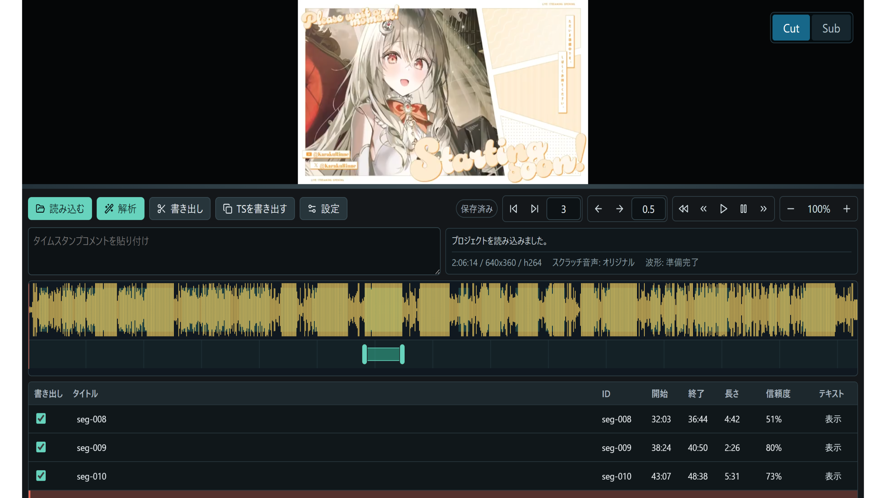
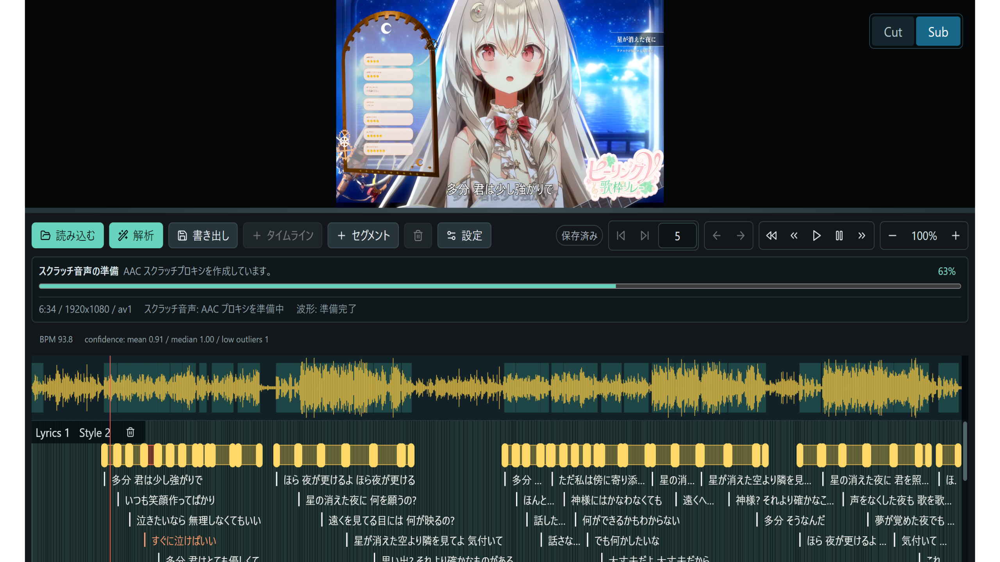
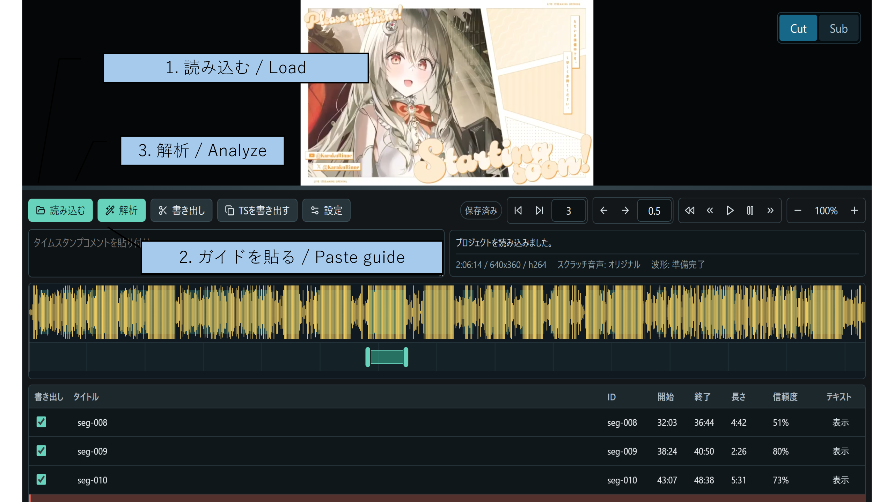
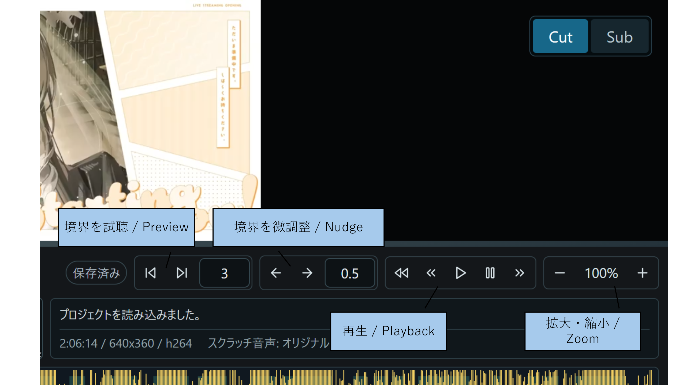
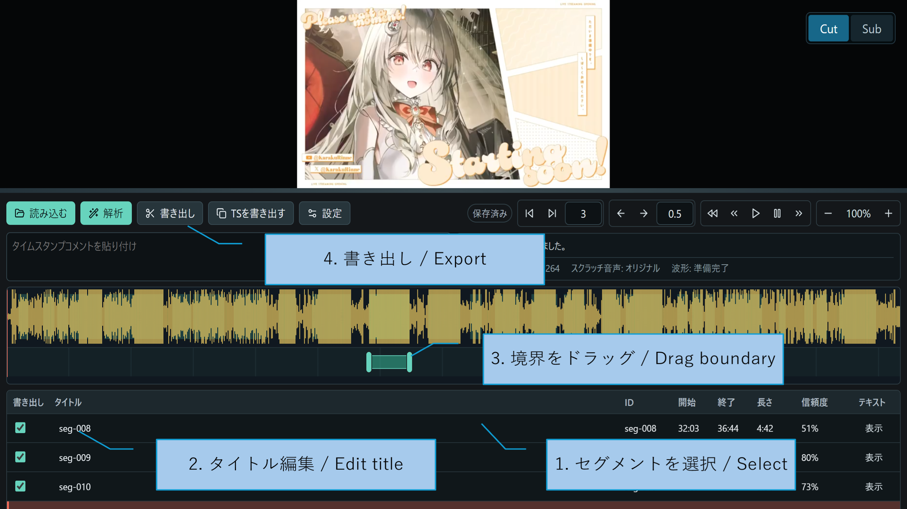
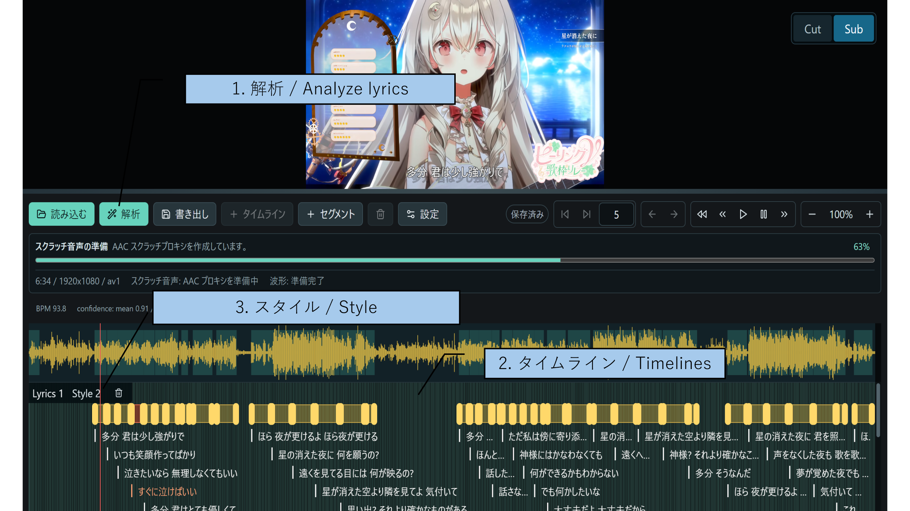
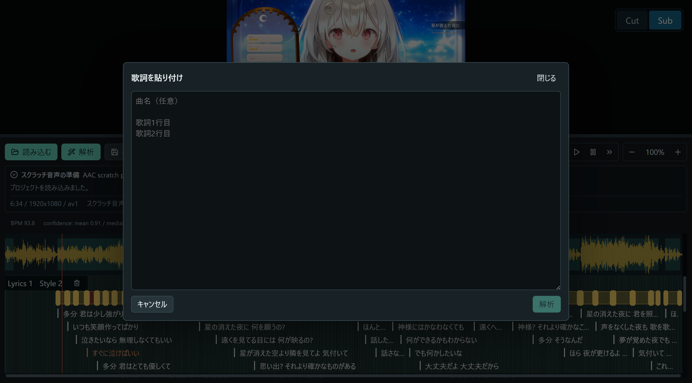
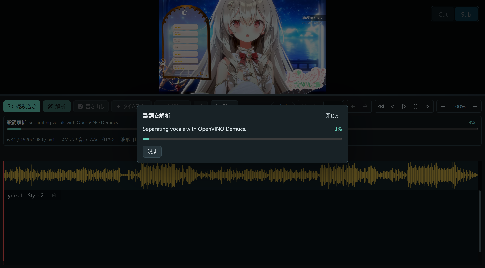
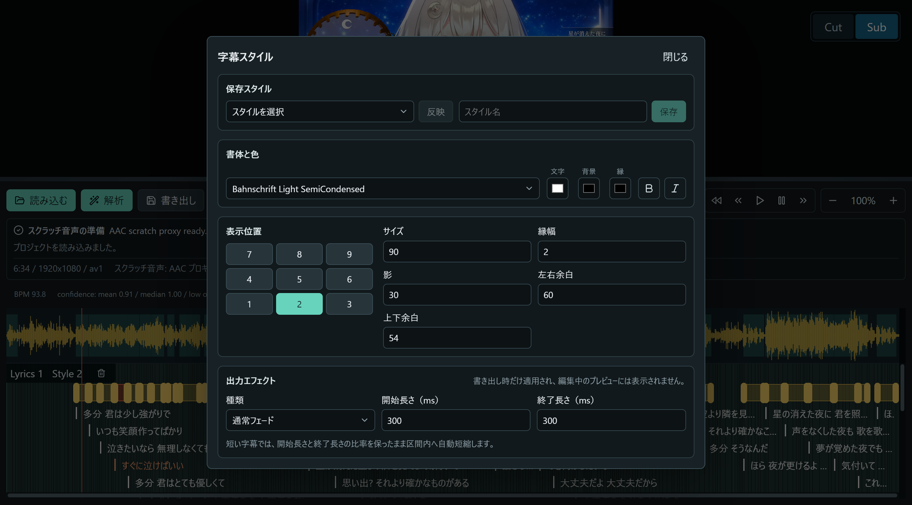

# Songcut User Guide

## Overview

Songcut has two modes: `Cut` and `Sub`.

- `Cut`: Extracts singing sections from videos
- `Sub`: Aligns lyrics with a video to create subtitles

After loading a video, choose `Cut` or `Sub` in the tabs at the top of the window to select the task.

### Cut Mode

In Cut, review detected singing sections as segments and edit their titles, boundaries, and export selection.
Use the waveform and preview to make one clip or timestamp entry per song.



### Sub Mode

In Sub, align lyrics to the audio and edit text, timing, and position across subtitle timelines.
After setting subtitle styles, export a subtitled video and one subtitle file set per timeline.



## Common Operations

### Preparation

If Songcut cannot find FFmpeg at startup, install it with the following command and restart Songcut.

```powershell
winget install Gyan.FFmpeg
```

To prepare a YouTube video, install `yt-dlp` and Deno, then run the following command.

```powershell
winget install yt-dlp.yt-dlp
winget install DenoLand.Deno
yt-dlp --write-info-json --write-comments "<YouTube URL>"
```

With `--write-info-json` and `--write-comments`, Cut can use timestamps from the video description or downloaded comments as guide candidates.

### Loading a Video

Click `Load` and choose a video file to show it in the upper preview and lower timeline.



Waveform preparation starts after loading, and completed portions can be used for seeking while preparation continues.
Cut and Sub each have an independent **Waveform display** choice under `Settings > Cut` or `Settings > Sub` with `RMS`, `Peak Envelope`, `Peak + RMS`, and `Symmetric Peak`.

For videos with Opus audio, Songcut prepares fast-seeking AAC scratch audio in the background.
Normal playback and export continue to use the source video, and scratch audio can be disabled with **Use scratch audio proxy** in Settings.

### Adjusting Segments

Drag the left or right handle of a timeline section to change its start or end.
Double-click a section to show **Segment timing**, where you can enter a start time and either a duration or an end time.

Playback, boundary preview, boundary navigation, and zoom work the same way in Cut and Sub.
See [KEYBOARD_SHORTCUTS.md](KEYBOARD_SHORTCUTS.md) for the complete keyboard reference.



## Cut

Cut is for making one clip per song from a stream or other long video.
Load a video, optionally paste a timestamp comment into the guide field, and click `Analyze` to show detected singing sections as segments.
If a matching `.info.json` file exists beside the video, review timestamps found in the video description or downloaded comments and apply only the guide you want to use.

Select an analyzed segment to edit its title, start and end times, and export checkbox.
The `Segment` menu can add or remove segments, sort them by start time, and change the export selection in one operation.
When using a timestamp guide, remove entries that are not songs, such as the stream start, MC, promotions, chat, or announcements, before applying it.



In Cut, `Q` and `E` nudge the nearest boundary by the configured number of seconds, while `W` and `S` select the previous and next Cut segment.
Only the Cut settings include **Amplitude range**, which can switch between the standard view and the singing/MC contrast view.

### Transcribe with Whisper

Automatic transcription after Cut analysis is off for new projects.
To use it, enable it under `Settings > Cut`, then choose the Whisper model, language, and device under `Settings > AI Models`.

After segment analysis, press **Transcribe / Re-transcribe** under `Settings > Cut` to run transcription later.
Press it again after changing the model or language to transcribe with the new settings.

### Export from Cut

Click `Export` to write a video clip for each checked segment.
The export review shows the actual filenames and the planned smart-rendering mode for each clip, and unsupported sources or ranges automatically fall back to a full re-encode.
You can group the clips and an optional timestamp file in a child folder named after the source video.

Click `Export TS` to copy the checked sections as timestamp text.
The `Export` menu can also copy Timestamp Comment, YouTube Chapters, TSV/Excel, CSV, or Audacity Labels directly.

## Sub

Sub is for editing timed lyrics and making a subtitled video.
Start analysis or export from the top toolbar, then refine subtitles on the subtitle timelines and in the style settings.



### Analyze Lyrics

When you load a video in Sub and click `Analyze`, Songcut prepares any required models and then shows the `Paste lyrics` dialog.
On the first run, the dialog appears after the models required by the selected alignment algorithm have been prepared, and `Songcut Standard` also prepares MMS.



Paste the lyrics one line at a time and click the dialog's `Analyze` button to start alignment.



When analysis finishes, review the displayed BPM, confidence statistics, and lines highlighted as low-confidence outliers.
Review the beat grid drawn on the timeline, and adjust boundaries manually if a beat-detection warning appears.

### Edit Text, Timing, and Timelines

Double-click a lyric label to edit its text, and drag a section handle to edit its timing.
Double-click a section to show **Segment timing**, where you can edit its start time and duration or end time.

Click `Timeline` and choose one of the nine subtitle positions to add a subtitle timeline.
Click a timeline to make it active; you can create up to three. `W` and `S` move through sections inside the active timeline.

Click `Segment` to add a new four-beat subtitle section at the selected position in the active timeline.
The toolbar trash button removes the selected subtitle section, while the trash button beside a timeline name removes that timeline.
In Sub, `Q` and `E` move the selected boundary to the previous or next quarter beat.

### Set a Style

Click a timeline's `Style` button to show `Subtitle style`.



In `Saved styles`, choose a preset and click `Apply`, or enter a style name and click `Save` to apply or save a preset.
`Typeface and colors` sets the font, text color, background color, outline color, bold, and italic options, while `Display position` sets the position, size, outline width, shadow, and horizontal and vertical margins.

`Output effects` are applied only during export and are not shown in the editing preview.

### Export Subtitles

Click `Export` and choose an output folder to create a subtitled video and one subtitle file set per timeline.
The subtitled video is named `<video>-subtitled.mp4`, and timelines are written as `<video>-sub-1.srt`, `<video>-sub-2.srt`, and so on.
Each SRT has a matching style file such as `<video>-sub-1.srt.style`.

## Settings

The settings dialog has four tabs: `Common`, `Cut`, `Sub`, and `AI Models`.

### Common

The Common tab sets the scratch preview duration, scratch audio proxy, display language, and FFmpeg check.
Under `Language`, choose `System default`, `English`, or `Japanese` to apply the new display language the next time Songcut starts.

### Cut

The Cut tab sets the waveform display, amplitude range, singing-analysis device, local boundary refinement, automatic Whisper transcription, and export filename template.
The export filename template accepts `{index}`, `{title}`, `{id}`, `{start}`, and `{end}`, and automatic Whisper transcription is off for new projects.

### Sub

The Sub tab sets the waveform display and lets you choose the lyrics alignment algorithm, `Songcut Standard` or `Uta-Align`.

### AI Models

The current default Whisper model in the AI Models tab is **Large v3 Turbo INT8 (OpenVINO)**.
Choose the Whisper language and device, then press `Prepare Whisper Model` when the selected model is not ready.
Sub analysis uses `Demucs` to separate vocals, so press `Prepare Demucs Model` when needed.
`MMS` is used only for lyric-onset refinement in `Songcut Standard` and is not used by `Uta-Align`.

## Saving and Recovery

Songcut autosaves edits beside the video, using a separate sidecar for each mode.
Cut projects use a `video.mp4.songcut` sidecar, while Sub projects use a separate `video.mp4.sub.songcut` sidecar.
Use `Ctrl+S` or `File > Save Project Now` to save immediately.

If recovery data is available after an abnormal exit, choose `Recover` or `Discard` at the next launch.
After moving or renaming the video, use `File > Relink Source` to choose the new file.
