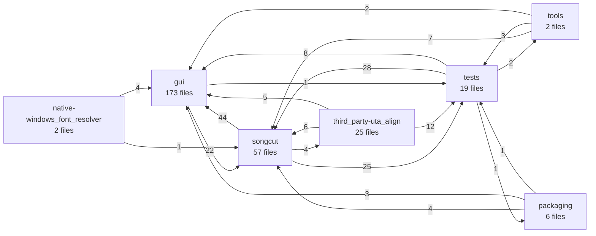

<!-- code-map:generated:start -->
## 読み方

このページのcomponentは、ディレクトリだけではなく、import・call・inheritの結合を重み付けして得た静的依存クラスタです。正式な組織境界や設計意図そのものとは限りません。

## Component一覧

| ID | 主な範囲 | ファイル | シンボル | 入／出境界 | 凝集度 | 推定責務 |
|---|---|---:|---:|---:|---:|---|
| `gui` | gui | 173 | 1347 | 66／23 | 0.98 | Electron メインプロセスと React レンダラーで構成されるデスクトップ編集 UI。Cut/Sub の編集操作、共有タイムラインのスクラブ・端部自動スクロール、再生範囲制御、Sub動画上の字幕・表示素プレビューと統合字幕ファイル書出し、Python API との連携、プロジェクト保存・復旧を扱う。 |
| `songcut` | songcut | 57 | 945 | 68／73 | 0.88 | FastAPI と CLI を入口に、動画・音声の解析、文字起こし、境界調整、波形生成、クリップ・字幕書き出しを提供する Python バックエンド。 |
| `third_party-uta_align` | third_party/uta_align | 25 | 373 | 4／23 | 0.90 | 歌詞と音声認識候補からアンカーと整列結果を構築し、候補合意、反復処理、フォールバック、整列検証を行う同梱 uta_align エンジン。 |
| `tests` | tests | 19 | 279 | 42／39 | 0.02 | Python バックエンド、Electron/React の状態・操作・永続化、および統合契約を検証する Python と TypeScript のテスト群。 |
| `packaging` | packaging | 6 | 88 | 1／8 | 0.00 | Windows 配布物の構築、パッケージ済み GUI の E2E スモーク検証、字幕フレーム評価などを担う配布・検証補助。 |
| `native-windows_font_resolver` | native/windows_font_resolver | 2 | 19 | 0／5 | 0.00 | `native/windows_font_resolver`を中心とする依存クラスタ。代表シンボル: ComApartmentScope, NameInfo, CandidateInfo, CandidateRef |
| `tools` | tools | 2 | 102 | 2／12 | 0.09 | `tools`を中心とする依存クラスタ。代表シンボル: BenchmarkDatasetProfile, BenchmarkDataError, MonoLabel, duration |

## 依存地図

矢印は静的に解決できた境界越え依存、数字は対応するfile-level edge数です。動的DI、reflection、文字列指定のプラグイン読込は図へ現れない可能性があります。

## Component別の根拠

### `gui`

`gui`を中心とする依存クラスタ。代表シンボル: initializeRendererI18n, tr, currentUiLanguage, if。
エージェント確認メモ: Electron メインプロセスと React レンダラーで構成されるデスクトップ編集 UI。Cut/Sub の編集操作、共有タイムラインのスクラブ・端部自動スクロール、再生範囲制御、Sub動画上の字幕・表示素プレビューと統合字幕ファイル書出し、Python API との連携、プロジェクト保存・復旧を扱う。

代表パス:
- `gui/src/i18n.ts`
- `gui/src/App.tsx`
- `gui/src/lib/subtitles.ts`
- `gui/src/types.ts`
- `gui/electron/project-schema.ts`

境界: incoming 66、outgoing 23、内部凝集度 0.98。

### `songcut`

`songcut`を中心とする依存クラスタ。代表シンボル: ProbeRequest, BoundaryRefinementRequest, validate_hysteresis, to_config。
エージェント確認メモ: FastAPI と CLI を入口に、動画・音声の解析、文字起こし、境界調整、波形生成、クリップ・字幕書き出しを提供する Python バックエンド。

代表パス:
- `songcut/api.py`
- `tests/test_api.py`
- `gui/src/components/SubtitleStyleEditor.tsx`
- `songcut/subtitle_export.py`
- `songcut/transcription.py`

境界: incoming 68、outgoing 73、内部凝集度 0.88。

### `third_party-uta_align`

`third_party/uta_align`を中心とする依存クラスタ。代表シンボル: parse_lyrics_text, load_lyrics, _context_token_count, _truncate_context。
エージェント確認メモ: 歌詞と音声認識候補からアンカーと整列結果を構築し、候補合意、反復処理、フォールバック、整列検証を行う同梱 uta_align エンジン。

代表パス:
- `third_party/uta_align/src/uta_align/lyrics.py`
- `third_party/uta_align/src/uta_align/pipeline.py`
- `third_party/uta_align/tests/test_candidate_consensus.py`
- `third_party/uta_align/src/uta_align/fallback.py`
- `third_party/uta_align/src/uta_align/alignment.py`

境界: incoming 4、outgoing 23、内部凝集度 0.90。

### `tests`

`tests`を中心とする依存クラスタ。代表シンボル: NativeFontCollectorError, __init__, _CreateRequest, _EnumRequest。
エージェント確認メモ: Python バックエンド、Electron/React の状態・操作・永続化、および統合契約を検証する Python と TypeScript のテスト群。

代表パス:
- `songcut/windows_font_native.py`
- `tests/test_subtitle_export.py`
- `tests/test_smart_export.py`
- `tests/test_mms_alignment.py`
- `tests/test_kiritan_display_benchmark.py`

境界: incoming 42、outgoing 39、内部凝集度 0.02。

### `packaging`

`packaging`を中心とする依存クラスタ。代表シンボル: _set_windows_dll_directory, spawn_external_process, distribution_root, configure_logging。
エージェント確認メモ: Windows 配布物の構築、パッケージ済み GUI の E2E スモーク検証、字幕フレーム評価などを担う配布・検証補助。

代表パス:
- `packaging/songcut_launcher_entry.py`
- `packaging/e2e_sub_mode.js`
- `packaging/evaluate_subtitle_frame.py`
- `packaging/e2e_scratch_proxy.js`
- `packaging/build_dist.ps1`

境界: incoming 1、outgoing 8、内部凝集度 0.00。

### `native-windows_font_resolver`

`native/windows_font_resolver`を中心とする依存クラスタ。代表シンボル: ComApartmentScope, NameInfo, CandidateInfo, CandidateRef。

代表パス:
- `native/windows_font_resolver/src/scut_windows_font_resolver.cpp`
- `native/windows_font_resolver/tests/scut_windows_font_resolver_tests.cpp`

境界: incoming 0、outgoing 5、内部凝集度 0.00。

### `tools`

`tools`を中心とする依存クラスタ。代表シンボル: BenchmarkDatasetProfile, BenchmarkDataError, MonoLabel, duration。

代表パス:
- `tools/benchmark_kiritan_display_elements.py`
- `tools/probe_omniasr_ctc_targets.py`

境界: incoming 2、outgoing 12、内部凝集度 0.09。
<!-- code-map:generated:end -->
