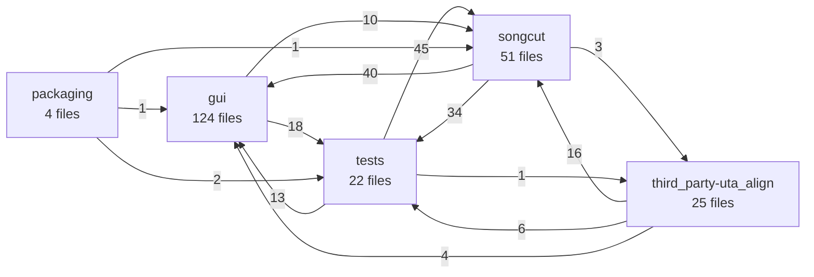

<!-- code-map:generated:start -->
## 読み方

このページのcomponentは、ディレクトリだけではなく、import・call・inheritの結合を重み付けして得た静的依存クラスタです。正式な組織境界や設計意図そのものとは限りません。

## Component一覧

| ID | 主な範囲 | ファイル | シンボル | 入／出境界 | 凝集度 | 推定責務 |
|---|---|---:|---:|---:|---:|---|
| `gui` | gui | 124 | 981 | 58／28 | 0.96 | Electron メインプロセスと React レンダラーで構成されるデスクトップ編集 UI。Cut/Sub の編集操作、Python API との連携、プロジェクト保存・復旧を扱う。 |
| `songcut` | songcut | 51 | 810 | 72／77 | 0.72 | FastAPI と CLI を入口に、動画・音声の解析、文字起こし、境界調整、波形生成、クリップ・字幕書き出しを提供する Python バックエンド。 |
| `third_party-uta_align` | third_party/uta_align | 25 | 373 | 4／26 | 0.81 | 歌詞と音声認識候補からアンカーと整列結果を構築し、候補合意、反復処理、フォールバック、整列検証を行う同梱 uta_align エンジン。 |
| `tests` | tests | 22 | 253 | 60／59 | 0.02 | Python バックエンド、Electron/React の状態・操作・永続化、および統合契約を検証する Python と TypeScript のテスト群。 |
| `packaging` | packaging | 4 | 44 | 0／4 | 0.00 | Windows 配布物の構築、パッケージ済み GUI の E2E スモーク検証、字幕フレーム評価などを担う配布・検証補助。 |

## 依存地図

矢印は静的に解決できた境界越え依存、数字は対応するfile-level edge数です。動的DI、reflection、文字列指定のプラグイン読込は図へ現れない可能性があります。

## Component別の根拠

### `gui`

`gui`を中心とする依存クラスタ。代表シンボル: initializeRendererI18n, tr, currentUiLanguage, if。
エージェント確認メモ: Electron メインプロセスと React レンダラーで構成されるデスクトップ編集 UI。Cut/Sub の編集操作、Python API との連携、プロジェクト保存・復旧を扱う。

代表パス:
- `gui/src/i18n.ts`
- `gui/src/App.tsx`
- `gui/src/components/AppDialogs.tsx`
- `gui/src/types.ts`
- `gui/src/components/SettingsDialog.tsx`

境界: incoming 58、outgoing 28、内部凝集度 0.96。

### `songcut`

`songcut`を中心とする依存クラスタ。代表シンボル: ProbeRequest, BoundaryRefinementRequest, validate_hysteresis, to_config。
エージェント確認メモ: FastAPI と CLI を入口に、動画・音声の解析、文字起こし、境界調整、波形生成、クリップ・字幕書き出しを提供する Python バックエンド。

代表パス:
- `songcut/api.py`
- `gui/src/components/SubModePanel.tsx`
- `songcut/transcription.py`
- `songcut/subtitle_export.py`
- `songcut/ffmpeg_tools.py`

境界: incoming 72、outgoing 77、内部凝集度 0.72。

### `third_party-uta_align`

`third_party/uta_align`を中心とする依存クラスタ。代表シンボル: _context_token_count, _truncate_context, _local_lyric_context, _request_with_strategy。
エージェント確認メモ: 歌詞と音声認識候補からアンカーと整列結果を構築し、候補合意、反復処理、フォールバック、整列検証を行う同梱 uta_align エンジン。

代表パス:
- `third_party/uta_align/src/uta_align/pipeline.py`
- `third_party/uta_align/src/uta_align/lyrics.py`
- `third_party/uta_align/src/uta_align/fallback.py`
- `third_party/uta_align/tests/test_candidate_consensus.py`
- `third_party/uta_align/src/uta_align/alignment.py`

境界: incoming 4、outgoing 26、内部凝集度 0.81。

### `tests`

`tests`を中心とする依存クラスタ。代表シンボル: put, get, invalidate, clear。
エージェント確認メモ: Python バックエンド、Electron/React の状態・操作・永続化、および統合契約を検証する Python と TypeScript のテスト群。

代表パス:
- `gui/src/lib/waveformSessionCache.ts`
- `tests/test_api.py`
- `tests/test_smart_export.py`
- `tests/test_subtitle_export.py`
- `tests/test_mms_alignment.py`

境界: incoming 60、outgoing 59、内部凝集度 0.02。

### `packaging`

`packaging`を中心とする依存クラスタ。代表シンボル: extract_frame, weighted_bounds, quantile_bounds, weighted_centroid。
エージェント確認メモ: Windows 配布物の構築、パッケージ済み GUI の E2E スモーク検証、字幕フレーム評価などを担う配布・検証補助。

代表パス:
- `packaging/evaluate_subtitle_frame.py`
- `packaging/e2e_scratch_proxy.js`
- `packaging/build_dist.ps1`
- `packaging/build_native_font_resolver.ps1`

境界: incoming 0、outgoing 4、内部凝集度 0.00。
<!-- code-map:generated:end -->
